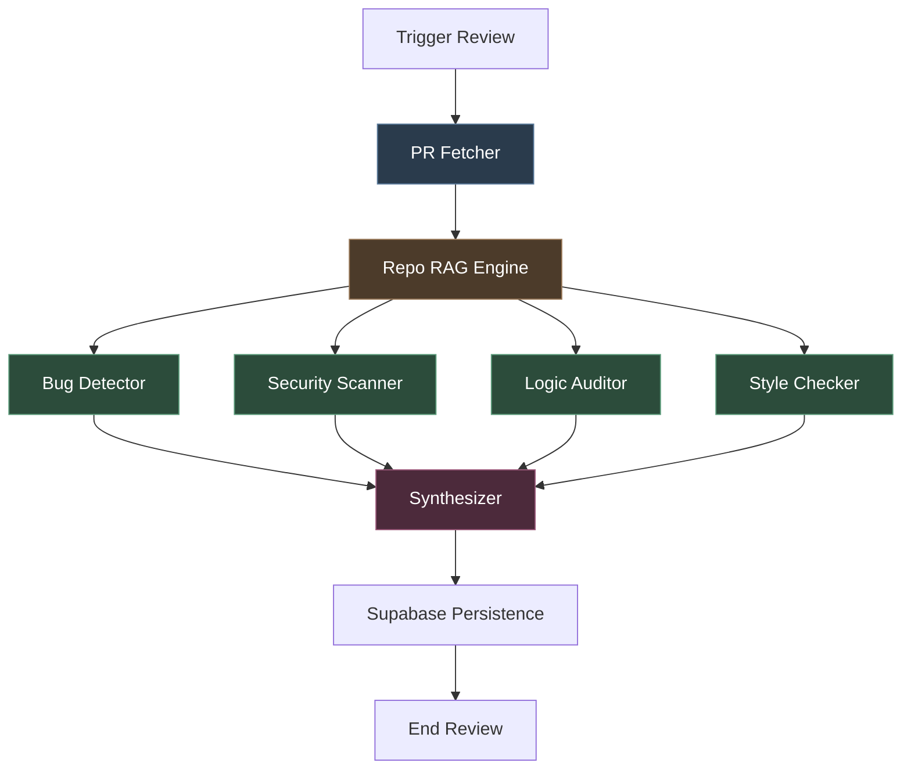
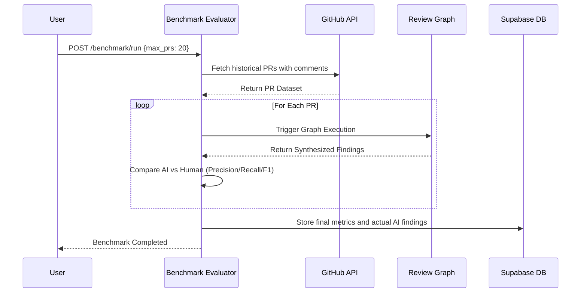

# PRISM: Autonomous Pull-Request Intelligence Platform

[]()
[]()
[]()

PRISM is a state-of-the-art, multi-agent AI system designed to conduct deep, comprehensive code reviews. By combining semantic Retrieval-Augmented Generation (RAG) with parallel specialized agents, PRISM moves beyond simple syntax checking to identify profound logic flaws, security vulnerabilities, and architectural inconsistencies in pull requests.

## 🚀 The Result: Outperforming Human Reviewers

PRISM was rigorously benchmarked against human reviewers across **19 real-world pull requests** in the open-source `langchain-ai/langgraph` repository.

**Benchmark Metrics:**
- **Average Recall: 0.47** (Successfully caught nearly 50% of every issue flagged by human maintainers)
- **Average F1 Score: 0.33** (With some individual PRs scoring as high as **0.83 F1!**)

**Beyond the Benchmark:**
More importantly, the benchmark metrics only tell half the story. PRISM consistently found **critical vulnerabilities and logic bugs that human reviewers completely missed.** During the benchmark run, PRISM successfully identified 103 issues compared to the 83 human comments. 

Two examples of CRITICAL bugs PRISM caught that were completely missed by humans and merged into `langgraph`:
1. **Async Event Loop Deadlock:** PRISM caught a blocking call (`concurrent.futures.wait(futs)`) being used inside an async context (`AsyncPregelLoop`), warning that it would block the entire event loop and cause severe performance degradation or deadlocks.
2. **Runtime Deserialization Crash:** PRISM flagged an invalid global constant initialization (`Reviver(allowed_objects='core')`) that was expecting a list, warning that it would cause `TypeError` runtime crashes during LC:2 envelope deserialization.

---

## 🧠 How We Built It: Architecture & Tech Stack

PRISM relies on **LangGraph** to coordinate parallel agent execution and **FastAPI** to serve Server-Sent Events (SSE) for real-time dashboard updates. 

### Core Tech Stack
- **AI Orchestration**: LangGraph
- **Language Models**: Google Gemini 3.1 Flash Lite
- **Embeddings**: HuggingFace SentenceTransformers (`all-MiniLM-L6-v2`) running fully locally on CPU
- **Vector Database**: FAISS (with persistent disk caching)
- **Backend Infrastructure**: FastAPI, Python
- **Database**: Supabase (Async Client)
- **Code Extraction**: PyGithub

### Advanced Hybrid Retrieval (AST + Semantic RAG)
When a review is requested, PRISM doesn't just read the diff. It reads the whole repo:
1. **Extraction**: Pulls down the raw code diff and metadata via the GitHub API.
2. **Structural CodeGraph**: Parses the entire repository into an Abstract Syntax Tree (AST) to build a structural "CodeGraph" mapping functions, classes, and call edges.
3. **Semantic FAISS**: Embeds 18,000+ code chunks locally using HuggingFace embeddings and stores them in a FAISS vector index.
4. **Context Injection**: When an agent reviews a diff, it performs a hybrid retrieval—pulling the specific structural dependencies from the CodeGraph AND the semantic similarities from FAISS.

### Multi-Agent Graph Execution
The core of PRISM is its directed acyclic graph (DAG) execution model, which guarantees high concurrency without deadlocks. Four distinct LLM agents evaluate the codebase simultaneously before passing their results to a Synthesizer.



---

## 📊 Benchmark Framework

To ensure the highest standard of review quality, PRISM ships with an automated benchmarking suite. This pipeline allows organizations to evaluate PRISM against historical human code reviews.



---

## 📂 Directory Structure

```text
PRISM/
├── agents/             # Logic for RAG, specialized reviewers, and synthesizer
├── api/
│   ├── routes/         # FastAPI endpoints (Review, Benchmark)
│   ├── db/             # Supabase schema and client operations
│   └── main.py         # Application entry point
├── benchmark/          # Historical PR collection and F1-score evaluation suite
├── frontend/           # Next.js web application and UI components
├── graph/              # LangGraph compilation and state management
└── config.py           # Environment and model configurations
```

---

## 🛠️ Installation and Setup

### Prerequisites
- Python 3.10+
- Node.js 18+
- Active Supabase instance

### Backend Installation

1. Navigate to the backend directory and initialize a virtual environment:
   ```bash
   python -m venv .venv
   source .venv/bin/activate  # Windows: .venv\Scripts\activate
   ```

2. Install backend dependencies:
   ```bash
   pip install -r requirements.txt
   ```

### Frontend Installation

1. Navigate to the frontend directory:
   ```bash
   cd frontend
   ```

2. Install frontend dependencies:
   ```bash
   npm install
   ```

---

## ⚙️ Configuration

Duplicate the `.env.example` file and rename it to `.env` in the root backend directory. The following credentials are required:

```ini
# Google Generative AI configurations
GEMINI_API_KEY=your_gemini_api_key

# GitHub Authentication
GITHUB_TOKEN=your_github_personal_access_token

# Supabase Credentials
SUPABASE_URL=your_supabase_project_url
SUPABASE_KEY=your_supabase_service_role_key
```

---

## 💻 Usage

### 1. Start the Backend API
```bash
uvicorn api.main:app --port 8000
```

### 2. Start the Frontend Application
```bash
cd frontend
npm run dev
```

### 3. Submitting a Pull Request
Navigate to `http://localhost:3000` in your web browser. Input a target repository and Pull Request ID. The dashboard will utilize Server-Sent Events (SSE) to render the parallel execution of agents and stream the final findings.

### 4. Running the Benchmark
To evaluate PRISM's performance on historical data, execute the following command in a secondary terminal:

```bash
curl -X POST "http://127.0.0.1:8000/benchmark/run" \
     -H "Content-Type: application/json" \
     -d "{\"repo\": \"langchain-ai/langgraph\", \"max_prs\": 20}"
```
The results will be available as a structured JSON artifact inside `benchmark/results/`.
