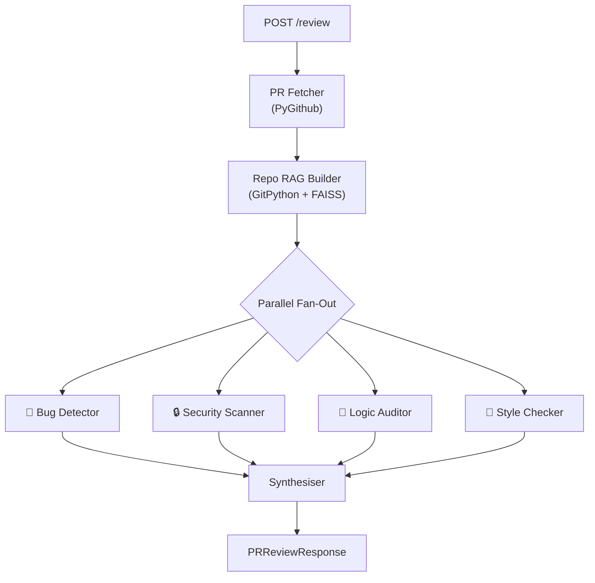

# 🔷 PRISM — Autonomous GitHub PR Review System

> **Current Status**: 🟢 Alpha / Core Implementation Complete

PRISM is a multi-agent code review system powered by **LangGraph**, **Gemini 1.5 Pro**, and **FAISS** vector search. It automatically fetches a GitHub pull request, builds a RAG index of the repository, and dispatches four specialised review agents **in parallel**—each analysing the diff through a different lens. A synthesiser agent deduplicates, ranks, and summarises the findings into a single actionable review.

---

## 📊 Current Project Status

The foundational architecture and all 25 core files have been fully implemented.

### ✅ What is Working
- **LangGraph Orchestration**: The `StateGraph` successfully fans out to four parallel agents and fans back into the synthesizer.
- **RAG Implementation**: `RepoRAG` agent successfully shallow-clones the target repo, chunks the codebase, and creates a FAISS vector index.
- **Specialised Agents**:
  - `Bug Detector`: Checks for logic flaws and memory/resource issues.
  - `Security Scanner`: Uses the OWASP Top 10 framework for vulnerability detection.
  - `Logic Auditor`: Assesses algorithmic correctness and boundary conditions.
  - `Style Checker`: Evaluates codebase conventions across 11+ languages.
- **Synthesiser**: Deduplicates overlapping findings and computes severity statistics.
- **FastAPI Backend**: `POST /review` and `GET /benchmark` endpoints are fully operational.
- **Benchmarking Suite**: Capable of scraping merged PRs with human reviews and evaluating PRISM's F1, Precision, and Recall scores.

### 🚧 What Remains / Next Steps
- **Integration Testing**: End-to-end testing with live GitHub PRs to ensure rate limits and context windows hold up under load.
- **Prompt Tuning**: Iteratively tuning the agent prompts based on the benchmark results.
- **GitHub App Integration**: Converting from a script-based personal access token system to a native GitHub App installation (listening for webhooks).
- **Frontend / Dashboard**: Adding a web UI (or Supabase integration) to persist and view past reviews.
- **CI/CD**: Setting up automated workflows to build and publish the Docker container.

---

## 🏗 Architecture



---

## 🚀 Quick Start

### 1. Clone & Configure

```bash
git clone https://github.com/TANMaYtO/PRISM.git
cd prism
cp .env.example .env
# Edit .env with your Google Gemini and GitHub API keys
```

### 2. Install Dependencies

```bash
python -m venv .venv
# Windows:
.venv\Scripts\activate
# Mac/Linux:
source .venv/bin/activate

pip install -r requirements.txt
```

### 3. Run the Server

```bash
uvicorn api.main:app --reload --port 8000
```

### 4. Submit a Review

```bash
curl -X POST http://localhost:8000/review \
  -H "Content-Type: application/json" \
  -d '{
    "repo_owner": "langchain-ai",
    "repo_name": "langgraph",
    "pr_number": 42
  }'
```

---

## 🐳 Docker

```bash
docker build -t prism .
docker run -p 8000:8000 --env-file .env prism
```

---

## 📈 Benchmark System

PRISM includes a built-in benchmarking system that compares automated findings against human reviewer comments on real merged PRs.

### Running a Benchmark

```bash
curl -X POST http://localhost:8000/benchmark/run \
  -H "Content-Type: application/json" \
  -d '{"max_prs": 10, "repo": "langchain-ai/langgraph"}'
```

---

## 🔑 Environment Variables

| Variable | Required | Default | Description |
|----------|----------|---------|-------------|
| `GEMINI_API_KEY` | ✅ | — | Google Gemini API key |
| `GITHUB_TOKEN` | ✅ | — | GitHub personal access token |
| `SUPABASE_URL` | ✅ | — | Supabase project URL |
| `SUPABASE_KEY` | ✅ | — | Supabase anon/service key |
| `MODEL_NAME` | ❌ | `gemini-1.5-pro` | Gemini model name |
| `MAX_CONTEXT_TOKENS` | ❌ | `8000` | Max tokens for LLM context |
| `CHUNK_SIZE` | ❌ | `500` | RAG chunk size (characters) |
| `CHUNK_OVERLAP` | ❌ | `50` | RAG chunk overlap |

---

## 📄 License

MIT
